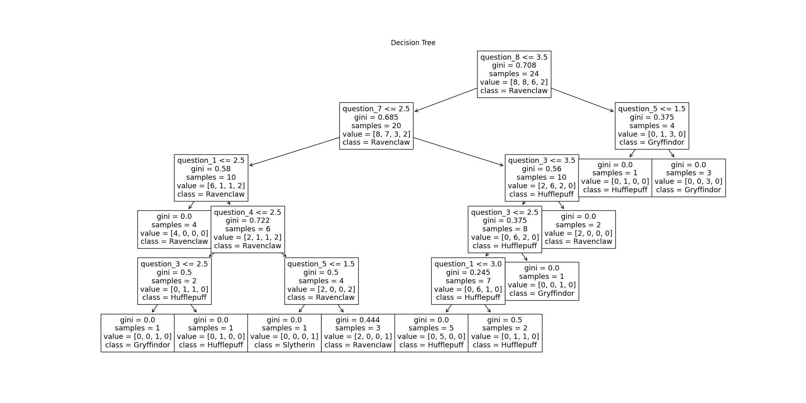

# Q1
I would remove these 4 least important questions, question_2, question_6, question_9 and question_10.  

Justification:  
Feature importance is 0.  
The model accuracy is 0.67 and there is no node judgement related to these four questions.  
Removing them reduces cognitive load for users without sacrificing model performance.  

# Q2_1
Collect more data and may try ensemble methods, or feature selection.  

# Q2_2
Add leds or a small motor to let the user know he has chosen one answeer.  

# Q2_3
Yes, it is good for discrete data input and interpretion with a small amount of features.  
Continuous data like voice spectrograms is not suitable, and instead neural network could be a choice.  
